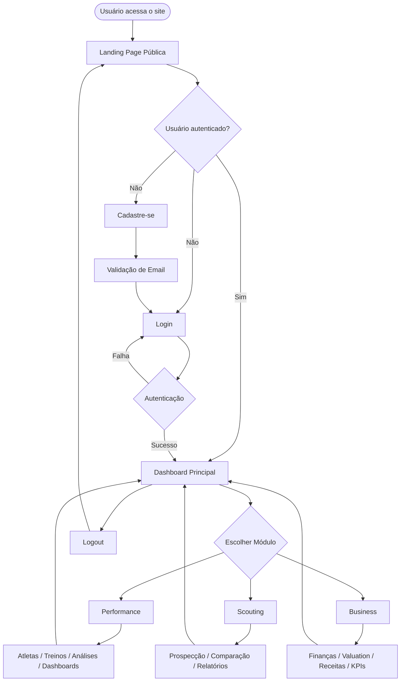
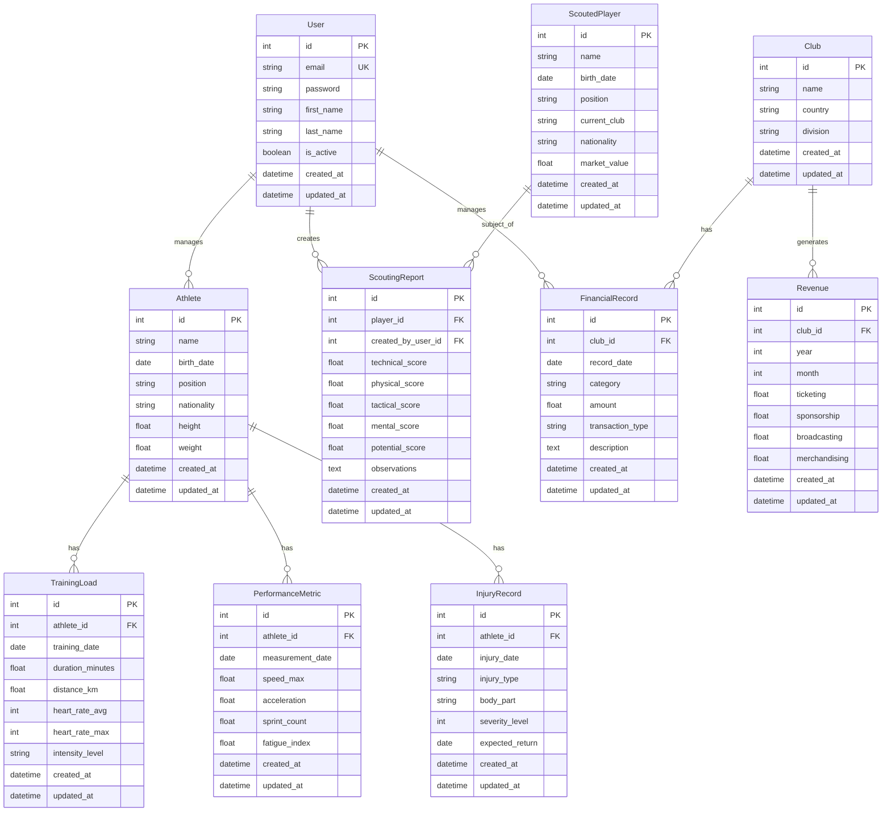

# PRD - AI Soccer
## Product Requirements Document

---

## 1. Visão Geral

O **AI Soccer** é um sistema web de gestão de dados baseado em decisões por inteligência artificial, voltado para o universo do futebol profissional. A plataforma integra três pilares fundamentais: **Performance**, **Scouting** e **Business**, oferecendo análises preditivas, dashboards interativos e insights estratégicos para clubes, federações, comissões técnicas e departamentos de análise.

O sistema utiliza técnicas de machine learning, análise de dados e modelagem preditiva para transformar informações brutas em decisões inteligentes, cobrindo desde prevenção de lesões até valuation de atletas e otimização de receitas.

---

## 2. Sobre o Produto

O **AI Soccer** é uma plataforma full-stack desenvolvida com Django e TailwindCSS, que centraliza ferramentas de análise de dados esportivos e gestão estratégica. A solução é dividida em três domínios principais:

- **Performance**: Monitoramento de atletas, análise tática, prevenção de lesões
- **Scouting**: Prospecção de talentos, análise de mercado, detecção de perfis
- **Business**: Gestão financeira, comercial e institucional de clubes

O sistema é acessível via web, responsivo e conta com autenticação nativa do Django baseada em email.

---

## 3. Propósito

Fornecer uma solução tecnológica integrada que:

- Conecte ciência de dados ao trabalho de campo no futebol
- Apoie decisões estratégicas com base em inteligência artificial
- Reduza riscos financeiros e esportivos através de análise preditiva
- Democratize o acesso à análise avançada de dados no futebol

---

## 4. Público Alvo

- **Clubes de futebol profissional**: Departamentos de análise de desempenho, scouting e gestão
- **Comissões técnicas**: Treinadores, analistas táticos, preparadores físicos
- **Federações e confederações**: Gestores esportivos e administrativos
- **Agentes e empresários**: Profissionais de mercado de transferências
- **Analistas independentes**: Consultores e profissionais do setor

---

## 5. Objetivos

### 5.1. Objetivos de Negócio
- Criar uma plataforma escalável e modular para gestão esportiva inteligente
- Estabelecer o AI Soccer como referência em análise de dados no futebol
- Facilitar a tomada de decisão baseada em dados para clubes e federações

### 5.2. Objetivos de Produto
- Implementar módulos de Performance, Scouting e Business integrados
- Desenvolver dashboards interativos e visualizações de dados claras
- Aplicar modelos de machine learning para análises preditivas
- Garantir experiência de usuário intuitiva e responsiva

### 5.3. Objetivos Técnicos
- Arquitetura modular baseada em apps Django isoladas
- Design system consistente com TailwindCSS
- Código limpo seguindo PEP 8
- Sistema de autenticação robusto baseado em email

---

## 6. Requisitos Funcionais

### 6.1. Módulo de Autenticação (Accounts)
- Cadastro de usuários com validação de email
- Login via email (não username)
- Recuperação de senha
- Perfis de usuário com permissões diferenciadas
- Logout seguro

### 6.2. Módulo de Performance
- Cadastro e gerenciamento de atletas
- Registro de cargas de treino
- Monitoramento de indicadores físicos (velocidade, distância, frequência cardíaca)
- Análise de padrões coletivos e individuais
- Modelagem preditiva para prevenção de lesões
- Dashboards de desempenho individual e coletivo
- Análise tática baseada em dados

### 6.3. Módulo de Scouting
- Cadastro de atletas prospectados
- Definição de KPIs técnicos, físicos e táticos
- Algoritmos de detecção de talentos
- Comparação de perfis de atletas
- Busca e filtragem avançada por posição, idade, características
- Análise de potencial esportivo com IA
- Relatórios de prospecção

### 6.4. Módulo de Business
- Gestão financeira de clube
- Valuation e precificação de atletas
- Análise de receitas e despesas
- Previsão de patrocínios e bilheteria
- Análise de comportamento de torcedor
- Otimização de calendário e logística
- Dashboards de KPIs comerciais e institucionais

### 6.5. Site Institucional
- Landing page pública de apresentação
- Seção "Sobre o AI Soccer"
- Seção "Funcionalidades"
- Call-to-action para cadastro e login
- Design responsivo e moderno

### 6.6. Dashboard Principal
- Visão consolidada dos três módulos
- Acesso rápido às principais funcionalidades
- Gráficos e indicadores resumidos
- Navegação intuitiva entre módulos

### 6.7. Flowchart de UX



---

## 7. Requisitos Não-Funcionais

### 7.1. Performance
- Tempo de resposta de páginas < 2 segundos
- Suporte a até 100 usuários simultâneos na MVP
- Otimização de queries do banco de dados

### 7.2. Usabilidade
- Interface intuitiva e responsiva
- Design consistente em todas as telas
- Feedback visual claro para ações do usuário
- Acessibilidade básica (contraste, fontes legíveis)

### 7.3. Segurança
- Autenticação segura com hash de senhas
- Proteção contra CSRF (nativo do Django)
- Validação de inputs
- Controle de permissões por usuário

### 7.4. Manutenibilidade
- Código seguindo PEP 8
- Separação clara de responsabilidades por apps
- Documentação inline quando necessário
- Nomenclatura em inglês no código

### 7.5. Portabilidade
- Sistema executável em Linux, Windows e macOS
- Banco de dados SQLite para facilitar deploy inicial
- Dependências gerenciadas via requirements.txt

### 7.6. Escalabilidade
- Arquitetura modular permitindo crescimento
- Estrutura preparada para migração futura para PostgreSQL
- Código preparado para conteinerização futura (Docker)

---

## 8. Arquitetura Técnica

### 8.1. Stack Tecnológica

**Backend**
- Python 3.12+
- Django 5.0+
- Django ORM
- SQLite (inicial)

**Frontend**
- Django Template Language (DTL)
- TailwindCSS 3.x
- Alpine.js (interatividade leve, se necessário)
- Chart.js ou ApexCharts (visualizações)

**Infraestrutura**
- Servidor de desenvolvimento Django
- Arquivos estáticos servidos pelo Django

**Ferramentas**
- Git (controle de versão)
- VS Code (IDE recomendada)

### 8.2. Estrutura de Apps Django

```
ai_soccer/
├── core/           # Configurações principais, URLs base
├── accounts/       # Autenticação e gerenciamento de usuários
├── performance/    # Módulo de análise de performance
├── scouting/       # Módulo de prospecção e scouting
├── business/       # Módulo de gestão financeira e comercial
├── static/         # Arquivos CSS, JS, imagens
├── templates/      # Templates base e compartilhados
└── media/          # Uploads de usuários (futuro)
```

### 8.3. Estrutura de Dados



---

## 9. Design System

### 9.1. Paleta de Cores

**Cores Primárias**
```css
/* Gradient principal */
--primary-from: #10b981    /* Green-500 */
--primary-to: #3b82f6      /* Blue-500 */

/* Acentos */
--accent: #8b5cf6          /* Purple-500 */
--accent-secondary: #ec4899 /* Pink-500 */
```

**Cores de Fundo (Dark Mode)**
```css
--bg-primary: #0f172a      /* Slate-900 */
--bg-secondary: #1e293b    /* Slate-800 */
--bg-tertiary: #334155     /* Slate-700 */
--bg-overlay: #475569      /* Slate-600 */
```

**Cores de Texto**
```css
--text-primary: #f1f5f9    /* Slate-100 */
--text-secondary: #cbd5e1  /* Slate-300 */
--text-muted: #94a3b8      /* Slate-400 */
```

**Cores de Status**
```css
--success: #10b981         /* Green-500 */
--warning: #f59e0b         /* Amber-500 */
--error: #ef4444           /* Red-500 */
--info: #3b82f6            /* Blue-500 */
```

### 9.2. Tipografia

**Fontes**
```css
font-family: 'Inter', system-ui, -apple-system, sans-serif;

/* Tamanhos */
--text-xs: 0.75rem;    /* 12px */
--text-sm: 0.875rem;   /* 14px */
--text-base: 1rem;     /* 16px */
--text-lg: 1.125rem;   /* 18px */
--text-xl: 1.25rem;    /* 20px */
--text-2xl: 1.5rem;    /* 24px */
--text-3xl: 1.875rem;  /* 30px */
--text-4xl: 2.25rem;   /* 36px */
```

### 9.3. Componentes TailwindCSS

#### Botões

**Botão Primário**
```html
<button class="px-6 py-3 bg-gradient-to-r from-green-500 to-blue-500 text-white font-semibold rounded-lg shadow-lg hover:shadow-xl transform hover:scale-105 transition-all duration-200">
    Botão Primário
</button>
```

**Botão Secundário**
```html
<button class="px-6 py-3 bg-slate-700 text-slate-100 font-semibold rounded-lg border border-slate-600 hover:bg-slate-600 transition-all duration-200">
    Botão Secundário
</button>
```

**Botão Ghost**
```html
<button class="px-6 py-3 text-slate-300 font-semibold rounded-lg hover:bg-slate-800 transition-all duration-200">
    Botão Ghost
</button>
```

#### Inputs e Forms

**Input Text**
```html
<input type="text" class="w-full px-4 py-3 bg-slate-800 border border-slate-700 rounded-lg text-slate-100 placeholder-slate-500 focus:outline-none focus:ring-2 focus:ring-green-500 focus:border-transparent transition-all duration-200" placeholder="Digite aqui...">
```

**Select**
```html
<select class="w-full px-4 py-3 bg-slate-800 border border-slate-700 rounded-lg text-slate-100 focus:outline-none focus:ring-2 focus:ring-green-500 focus:border-transparent transition-all duration-200">
    <option>Opção 1</option>
    <option>Opção 2</option>
</select>
```

**Textarea**
```html
<textarea class="w-full px-4 py-3 bg-slate-800 border border-slate-700 rounded-lg text-slate-100 placeholder-slate-500 focus:outline-none focus:ring-2 focus:ring-green-500 focus:border-transparent transition-all duration-200" rows="4" placeholder="Observações..."></textarea>
```

**Label**
```html
<label class="block text-sm font-medium text-slate-300 mb-2">Nome do Campo</label>
```

#### Cards

```html
<div class="bg-slate-800 border border-slate-700 rounded-xl shadow-lg p-6 hover:shadow-xl transition-all duration-200">
    <h3 class="text-xl font-bold text-slate-100 mb-2">Título do Card</h3>
    <p class="text-slate-400">Conteúdo do card...</p>
</div>
```

#### Navegação (Navbar)

```html
<nav class="bg-slate-900 border-b border-slate-800">
    <div class="container mx-auto px-4">
        <div class="flex items-center justify-between h-16">
            <div class="flex items-center space-x-8">
                <a href="/" class="text-2xl font-bold bg-gradient-to-r from-green-500 to-blue-500 bg-clip-text text-transparent">AI Soccer</a>
                <div class="hidden md:flex space-x-4">
                    <a href="#" class="text-slate-300 hover:text-white px-3 py-2 rounded-lg hover:bg-slate-800 transition-all">Performance</a>
                    <a href="#" class="text-slate-300 hover:text-white px-3 py-2 rounded-lg hover:bg-slate-800 transition-all">Scouting</a>
                    <a href="#" class="text-slate-300 hover:text-white px-3 py-2 rounded-lg hover:bg-slate-800 transition-all">Business</a>
                </div>
            </div>
            <div>
                <a href="#" class="px-4 py-2 bg-gradient-to-r from-green-500 to-blue-500 text-white font-semibold rounded-lg">Entrar</a>
            </div>
        </div>
    </div>
</nav>
```

#### Sidebar (Dashboard)

```html
<aside class="w-64 bg-slate-900 border-r border-slate-800 h-screen fixed left-0 top-0">
    <div class="p-6">
        <h2 class="text-2xl font-bold bg-gradient-to-r from-green-500 to-blue-500 bg-clip-text text-transparent mb-8">AI Soccer</h2>
        <nav class="space-y-2">
            <a href="#" class="flex items-center space-x-3 px-4 py-3 text-slate-300 hover:bg-slate-800 rounded-lg transition-all">
                <span>Dashboard</span>
            </a>
            <a href="#" class="flex items-center space-x-3 px-4 py-3 text-slate-300 hover:bg-slate-800 rounded-lg transition-all">
                <span>Performance</span>
            </a>
            <a href="#" class="flex items-center space-x-3 px-4 py-3 text-slate-300 hover:bg-slate-800 rounded-lg transition-all">
                <span>Scouting</span>
            </a>
            <a href="#" class="flex items-center space-x-3 px-4 py-3 text-slate-300 hover:bg-slate-800 rounded-lg transition-all">
                <span>Business</span>
            </a>
        </nav>
    </div>
</aside>
```

#### Grid System

```html
<!-- 2 Colunas -->
<div class="grid grid-cols-1 md:grid-cols-2 gap-6">
    <div>Coluna 1</div>
    <div>Coluna 2</div>
</div>

<!-- 3 Colunas -->
<div class="grid grid-cols-1 md:grid-cols-3 gap-6">
    <div>Coluna 1</div>
    <div>Coluna 2</div>
    <div>Coluna 3</div>
</div>

<!-- 4 Colunas -->
<div class="grid grid-cols-1 sm:grid-cols-2 lg:grid-cols-4 gap-6">
    <div>Coluna 1</div>
    <div>Coluna 2</div>
    <div>Coluna 3</div>
    <div>Coluna 4</div>
</div>
```

#### Tabelas

```html
<div class="overflow-x-auto">
    <table class="w-full">
        <thead class="bg-slate-800 border-b border-slate-700">
            <tr>
                <th class="px-6 py-3 text-left text-xs font-medium text-slate-300 uppercase tracking-wider">Coluna 1</th>
                <th class="px-6 py-3 text-left text-xs font-medium text-slate-300 uppercase tracking-wider">Coluna 2</th>
            </tr>
        </thead>
        <tbody class="bg-slate-900 divide-y divide-slate-800">
            <tr class="hover:bg-slate-800 transition-all">
                <td class="px-6 py-4 whitespace-nowrap text-sm text-slate-300">Dado 1</td>
                <td class="px-6 py-4 whitespace-nowrap text-sm text-slate-300">Dado 2</td>
            </tr>
        </tbody>
    </table>
</div>
```

#### Badges/Tags

```html
<span class="inline-flex items-center px-3 py-1 rounded-full text-xs font-medium bg-green-900 text-green-300">Ativo</span>
<span class="inline-flex items-center px-3 py-1 rounded-full text-xs font-medium bg-yellow-900 text-yellow-300">Pendente</span>
<span class="inline-flex items-center px-3 py-1 rounded-full text-xs font-medium bg-red-900 text-red-300">Inativo</span>
```

### 9.4. Layout Base

Todas as páginas internas seguirão este layout:

```
┌─────────────────────────────────────────────┐
│ Navbar (fixo no topo)                       │
├──────────┬──────────────────────────────────┤
│          │                                  │
│ Sidebar  │     Conteúdo Principal          │
│ (fixa)   │     (scroll vertical)            │
│          │                                  │
│          │                                  │
└──────────┴──────────────────────────────────┘
```

---

## 10. User Stories

### Épico 1: Autenticação e Onboarding

**US1.1 - Cadastro de Usuário**
- **Como** visitante do site
- **Quero** criar uma conta usando meu email
- **Para que** eu possa acessar o sistema AI Soccer

**Critérios de Aceite:**
- Formulário de cadastro solicita: nome, email, senha e confirmação de senha
- Sistema valida formato do email
- Sistema valida força da senha (mínimo 8 caracteres)
- Sistema exibe mensagem de erro clara em caso de falha
- Após cadastro bem-sucedido, usuário é redirecionado para login
- Email não pode ser duplicado no sistema

**US1.2 - Login de Usuário**
- **Como** usuário cadastrado
- **Quero** fazer login usando meu email e senha
- **Para que** eu possa acessar o dashboard

**Critérios de Aceite:**
- Formulário solicita email e senha
- Sistema autentica credenciais
- Em caso de sucesso, redireciona para dashboard principal
- Em caso de falha, exibe mensagem de erro clara
- Sistema mantém sessão ativa

**US1.3 - Recuperação de Senha**
- **Como** usuário que esqueceu a senha
- **Quero** solicitar redefinição de senha
- **Para que** eu possa recuperar acesso à minha conta

**Critérios de Aceite:**
- Link "Esqueci minha senha" visível na tela de login
- Sistema envia email com link de redefinição
- Link expira após 24 horas
- Usuário pode definir nova senha através do link

---

### Épico 2: Módulo de Performance

**US2.1 - Cadastro de Atletas**
- **Como** analista de performance
- **Quero** cadastrar atletas no sistema
- **Para que** eu possa monitorar seus dados

**Critérios de Aceite:**
- Formulário solicita: nome, data de nascimento, posição, nacionalidade, altura, peso
- Todos os campos são obrigatórios
- Sistema valida formato de data
- Lista de posições é predefinida (dropdown)
- Após cadastro, atleta aparece na listagem

**US2.2 - Registro de Carga de Treino**
- **Como** preparador físico
- **Quero** registrar dados de treino de um atleta
- **Para que** eu possa monitorar sua carga de trabalho

**Critérios de Aceite:**
- Formulário vincula registro a um atleta específico
- Campos: data, duração, distância, FC média, FC máxima, intensidade
- Sistema calcula índice de fadiga automaticamente
- Dados são salvos e exibidos no histórico do atleta

**US2.3 - Dashboard de Performance Individual**
- **Como** comissão técnica
- **Quero** visualizar dashboard de performance de um atleta
- **Para que** eu possa avaliar sua evolução

**Critérios de Aceite:**
- Dashboard exibe gráficos de evolução de carga
- Exibe métricas de velocidade, aceleração, sprints
- Exibe histórico de lesões (se houver)
- Exibe índice de risco de lesão (modelo preditivo)
- Gráficos são interativos e responsivos

**US2.4 - Registro de Lesões**
- **Como** médico do clube
- **Quero** registrar lesões de atletas
- **Para que** o histórico fique documentado

**Critérios de Aceite:**
- Formulário solicita: atleta, data, tipo de lesão, parte do corpo, gravidade, previsão de retorno
- Sistema exibe alertas quando atleta tem histórico de lesões
- Lesões aparecem no dashboard do atleta

---

### Épico 3: Módulo de Scouting

**US3.1 - Cadastro de Jogador Prospectado**
- **Como** scout
- **Quero** cadastrar jogadores observados
- **Para que** eu possa criar uma base de prospecção

**Critérios de Aceite:**
- Formulário solicita: nome, data de nascimento, posição, clube atual, nacionalidade, valor de mercado
- Sistema permite adicionar múltiplos jogadores
- Jogadores aparecem em listagem com filtros

**US3.2 - Criação de Relatório de Scouting**
- **Como** analista de scouting
- **Quero** avaliar um jogador prospectado
- **Para que** eu possa gerar relatórios técnicos

**Critérios de Aceite:**
- Formulário solicita notas de 0-10 para: técnica, físico, tático, mental, potencial
- Campo de observações permite texto livre
- Sistema calcula nota geral automaticamente
- Relatório fica vinculado ao jogador

**US3.3 - Comparação de Jogadores**
- **Como** diretor de futebol
- **Quero** comparar perfis de jogadores
- **Para que** eu possa decidir quem contratar

**Critérios de Aceite:**
- Sistema permite selecionar 2 ou mais jogadores
- Exibe comparação visual (gráfico radar) das notas
- Exibe tabela comparativa de características
- Permite exportar comparação (futuro)

**US3.4 - Busca Avançada de Jogadores**
- **Como** scout
- **Quero** buscar jogadores por critérios específicos
- **Para que** eu encontre perfis adequados

**Critérios de Aceite:**
- Filtros disponíveis: posição, idade, nacionalidade, nota mínima
- Sistema retorna resultados ordenados por relevância
- Resultados exibem informações resumidas do jogador

---

### Épico 4: Módulo de Business

**US4.1 - Cadastro de Clube**
- **Como** gestor
- **Quero** cadastrar informações do clube
- **Para que** eu possa gerenciar dados financeiros

**Critérios de Aceite:**
- Formulário solicita: nome do clube, país, divisão
- Sistema permite edição posterior
- Clube fica vinculado às transações financeiras

**US4.2 - Registro de Transação Financeira**
- **Como** diretor financeiro
- **Quero** registrar receitas e despesas
- **Para que** eu possa controlar o fluxo de caixa

**Critérios de Aceite:**
- Formulário solicita: data, categoria, valor, tipo (receita/despesa), descrição
- Sistema valida valores numéricos
- Transações aparecem em listagem cronológica
- Sistema calcula saldo automaticamente

**US4.3 - Dashboard Financeiro**
- **Como** presidente do clube
- **Quero** visualizar dashboard financeiro
- **Para que** eu possa tomar decisões estratégicas

**Critérios de Aceite:**
- Dashboard exibe receitas x despesas (gráfico)
- Exibe projeção de receitas (modelo preditivo)
- Exibe breakdown por categoria (bilheteria, patrocínio, etc.)
- Permite filtrar por período

**US4.4 - Valuation de Atleta**
- **Como** diretor esportivo
- **Quero** calcular valor de mercado de um atleta
- **Para que** eu possa negociar transferências

**Critérios de Aceite:**
- Sistema considera: idade, posição, performance, potencial
- Algoritmo de IA calcula valuation estimado
- Exibe comparação com valores de mercado reais
- Permite ajuste manual de parâmetros

---

### Épico 5: Site Institucional

**US5.1 - Landing Page Pública**
- **Como** visitante
- **Quero** conhecer o AI Soccer
- **Para que** eu decida se quero usar o sistema

**Critérios de Aceite:**
- Página exibe logo e slogan do AI Soccer
- Seção de funcionalidades principais (Performance, Scouting, Business)
- Call-to-action claro para cadastro
- Link para login
- Design responsivo

---

## 11. Métricas de Sucesso

### 11.1. KPIs de Produto

- **Taxa de adoção**: Número de clubes/usuários cadastrados
- **Engajamento**: Sessões por usuário por semana
- **Retenção**: Percentual de usuários ativos após 30 dias
- **Módulos mais usados**: Distribuição de uso entre Performance, Scouting e Business
- **Tempo médio de sessão**: Duração média de uso do sistema

### 11.2. KPIs de Performance Técnica

- **Tempo de carregamento de páginas**: < 2 segundos
- **Taxa de erros**: < 1% de requisições com erro
- **Disponibilidade**: > 99% de uptime

### 11.3. KPIs de Usuário

- **Satisfação (NPS)**: Meta de NPS > 50
- **Facilidade de uso**: Taxa de conclusão de tarefas > 90%
- **Precisão das análises de IA**: Acurácia dos modelos preditivos > 75%

### 11.4. KPIs de Negócio

- **Número de atletas cadastrados**: Meta de 100 atletas nos primeiros 3 meses
- **Relatórios de scouting gerados**: Meta de 50 relatórios/mês
- **Decisões baseadas em dados**: Número de transferências/contratações influenciadas pelo sistema

---

## 12. Riscos e Mitigações

### 12.1. Riscos Técnicos

| Risco | Probabilidade | Impacto | Mitigação |
|-------|---------------|---------|-----------|
| Performance lenta com grande volume de dados | Média | Alto | Implementar paginação, índices no banco, lazy loading |
| Modelos de IA com baixa acurácia | Média | Alto | Validação iterativa dos modelos, ajuste de hiperparâmetros |
| Problemas de responsividade | Baixa | Médio | Testes em múltiplos dispositivos, uso de TailwindCSS responsivo |
| Segurança de dados sensíveis | Baixa | Alto | Implementar boas práticas Django, HTTPS, validação rigorosa |

### 12.2. Riscos de Produto

| Risco | Probabilidade | Impacto | Mitigação |
|-------|---------------|---------|-----------|
| Usuários não entendem como usar o sistema | Média | Alto | Criar tooltips, tour guiado, documentação clara |
| Dados insuficientes para análises | Alta | Alto | Fornecer dados de exemplo, importação facilitada |
| Falta de integração com outras ferramentas | Média | Médio | Planejar APIs para integrações futuras |

### 12.3. Riscos de Negócio

| Risco | Probabilidade | Impacto | Mitigação |
|-------|---------------|---------|-----------|
| Baixa adoção inicial | Média | Alto | Marketing direcionado, parcerias com clubes |
| Concorrência estabelecida | Alta | Médio | Focar em diferenciais: IA integrada, custo acessível |
| Custos de infraestrutura | Baixa | Médio | Iniciar com SQLite, escalar gradualmente |

---

## 13. Lista de Tarefas

### Sprint 0: Configuração Inicial do Projeto
**Duração**: 1 semana

- [X] **Tarefa 0.1: Configuração do Ambiente de Desenvolvimento**
  - [X] 0.1.1: Instalar Python 3.12+ no ambiente de desenvolvimento
  - [X] 0.1.2: Criar ambiente virtual Python (`python -m venv venv`)
  - [X] 0.1.3: Ativar ambiente virtual
  - [X] 0.1.4: Criar arquivo `requirements.txt` com dependências iniciais
  - [X] 0.1.5: Instalar dependências (`pip install -r requirements.txt`)

- [X] **Tarefa 0.2: Criação do Projeto Django**
  - [X] 0.2.1: Criar projeto Django com nome `core`
  - [X] 0.2.2: Verificar se `manage.py` foi criado corretamente
  - [X] 0.2.3: Testar servidor de desenvolvimento
  - [X] 0.2.4: Acessar http://localhost:8000 e confirmar página inicial

- [ ] **Tarefa 0.3: Criação das Apps Django**
  - [X] 0.3.1: Criar app `accounts`
  - [X] 0.3.2: Criar app `performance`
  - [X] 0.3.3: Criar app `scouting`
  - [X] 0.3.4: Criar app `business`
  - [ ] 0.3.5: Registrar todas as apps em `core/settings.py`

- [ ] **Tarefa 0.4: Configuração Inicial do Django**
  - [ ] 0.4.1: Configurar `LANGUAGE_CODE = 'pt-br'`
  - [ ] 0.4.2: Configurar `TIME_ZONE = 'America/Sao_Paulo'`
  - [ ] 0.4.3: Configurar `USE_I18N` e `USE_TZ`
  - [ ] 0.4.4: Configurar diretório de templates
  - [ ] 0.4.5: Configurar diretório de arquivos estáticos
  - [ ] 0.4.6: Definir `STATIC_URL`

- [ ] **Tarefa 0.5: Estrutura de Diretórios**
  - [ ] 0.5.1: Criar diretório `templates/`
  - [ ] 0.5.2: Criar diretório `static/`
  - [ ] 0.5.3: Criar diretório `static/css/`
  - [ ] 0.5.4: Criar diretório `static/js/`
  - [ ] 0.5.5: Criar diretório `static/images/`

- [ ] **Tarefa 0.6: Configuração do TailwindCSS**
  - [ ] 0.6.1: Instalar Node.js
  - [ ] 0.6.2: Inicializar npm no projeto
  - [ ] 0.6.3: Instalar TailwindCSS via npm
  - [ ] 0.6.4: Criar arquivo de configuração do Tailwind
  - [ ] 0.6.5: Configurar `tailwind.config.js`
  - [ ] 0.6.6: Criar arquivo `static/css/input.css`
  - [ ] 0.6.7: Adicionar script de build no `package.json`
  - [ ] 0.6.8: Executar build inicial do CSS
  - [ ] 0.6.9: Verificar se `output.css` foi gerado

- [ ] **Tarefa 0.7: Configuração do Git**
  - [ ] 0.7.1: Inicializar repositório Git
  - [ ] 0.7.2: Criar arquivo `.gitignore`
  - [ ] 0.7.3: Adicionar padrões ao `.gitignore`
  - [ ] 0.7.4: Fazer commit inicial

---

### Sprint 1: Sistema de Autenticação e Landing Page
**Duração**: 2 semanas

- [ ] **Tarefa 1.1: Configuração do Modelo de Usuário Customizado**
  - [ ] 1.1.1: Criar modelo `CustomUser` em `accounts/models.py`
  - [ ] 1.1.2: Configurar `USERNAME_FIELD = 'email'`
  - [ ] 1.1.3: Adicionar campos `created_at` e `updated_at`
  - [ ] 1.1.4: Tornar campo `email` obrigatório e único
  - [ ] 1.1.5: Configurar `AUTH_USER_MODEL` em `settings.py`
  - [ ] 1.1.6: Criar migração inicial
  - [ ] 1.1.7: Executar migração

- [ ] **Tarefa 1.2: Criação do Template Base**
  - [ ] 1.2.1: Criar arquivo `templates/base.html`
  - [ ] 1.2.2: Adicionar carregamento do TailwindCSS
  - [ ] 1.2.3: Configurar blocos Django
  - [ ] 1.2.4: Adicionar meta tags responsivas
  - [ ] 1.2.5: Configurar classes para fundo escuro
  - [ ] 1.2.6: Adicionar fonte Inter via Google Fonts

- [ ] **Tarefa 1.3: Desenvolvimento da Landing Page**
  - [ ] 1.3.1: Criar view `HomeView` em `accounts/views.py`
  - [ ] 1.3.2: Criar template `templates/home.html`
  - [ ] 1.3.3: Implementar seção hero
  - [ ] 1.3.4: Adicionar logo "AI Soccer" com gradiente
  - [ ] 1.3.5: Criar seção de funcionalidades
  - [ ] 1.3.6: Adicionar ícones ou ilustrações
  - [ ] 1.3.7: Implementar seção de CTA
  - [ ] 1.3.8: Garantir responsividade
  - [ ] 1.3.9: Configurar URL raiz
  - [ ] 1.3.10: Testar em diferentes telas

- [ ] **Tarefa 1.4: Formulário de Cadastro de Usuário**
  - [ ] 1.4.1: Criar `CustomUserCreationForm`
  - [ ] 1.4.2: Configurar campos do formulário
  - [ ] 1.4.3: Adicionar validação de senha
  - [ ] 1.4.4: Adicionar classes CSS aos widgets
  - [ ] 1.4.5: Criar view `SignUpView`
  - [ ] 1.4.6: Criar template `signup.html`
  - [ ] 1.4.7: Implementar layout do formulário
  - [ ] 1.4.8: Adicionar mensagens de erro
  - [ ] 1.4.9: Configurar redirecionamento
  - [ ] 1.4.10: Adicionar URL `/signup/`
  - [ ] 1.4.11: Incluir URLs em `core/urls.py`
  - [ ] 1.4.12: Testar cadastro

- [ ] **Tarefa 1.5: Formulário de Login**
  - [ ] 1.5.1: Criar `CustomAuthenticationForm`
  - [ ] 1.5.2: Configurar campo para aceitar email
  - [ ] 1.5.3: Adicionar classes CSS
  - [ ] 1.5.4: Criar view `LoginView`
  - [ ] 1.5.5: Criar template `login.html`
  - [ ] 1.5.6: Implementar layout
  - [ ] 1.5.7: Adicionar link "Esqueci minha senha"
  - [ ] 1.5.8: Adicionar link "Cadastre-se"
  - [ ] 1.5.9: Configurar redirecionamento
  - [ ] 1.5.10: Adicionar URL `/login/`
  - [ ] 1.5.11: Configurar `LOGIN_URL`
  - [ ] 1.5.12: Configurar `LOGIN_REDIRECT_URL`
  - [ ] 1.5.13: Testar login

- [ ] **Tarefa 1.6: Funcionalidade de Logout**
  - [ ] 1.6.1: Criar view `LogoutView`
  - [ ] 1.6.2: Configurar redirecionamento
  - [ ] 1.6.3: Adicionar URL `/logout/`
  - [ ] 1.6.4: Configurar `LOGOUT_REDIRECT_URL`
  - [ ] 1.6.5: Testar logout

- [ ] **Tarefa 1.7: Backend de Autenticação por Email**
  - [ ] 1.7.1: Criar `EmailBackend` em `accounts/backends.py`
  - [ ] 1.7.2: Implementar método `authenticate`
  - [ ] 1.7.3: Configurar `AUTHENTICATION_BACKENDS`
  - [ ] 1.7.4: Testar autenticação por email

- [ ] **Tarefa 1.8: Testes de Integração**
  - [ ] 1.8.1: Testar fluxo completo
  - [ ] 1.8.2: Testar acesso a páginas protegidas
  - [ ] 1.8.3: Testar logout e redirecionamento
  - [ ] 1.8.4: Validar mensagens
  - [ ] 1.8.5: Validar responsividade

---

### Sprint 2: Dashboard Principal e Navegação
**Duração**: 1 semana

- [ ] **Tarefa 2.1: Criação do Template Base do Dashboard**
  - [ ] 2.1.1: Criar `templates/dashboard/base_dashboard.html`
  - [ ] 2.1.2: Implementar sidebar fixa
  - [ ] 2.1.3: Adicionar logo no topo da sidebar
  - [ ] 2.1.4: Implementar área de conteúdo principal
  - [ ] 2.1.5: Adicionar navbar superior
  - [ ] 2.1.6: Adicionar botão de logout
  - [ ] 2.1.7: Implementar menu mobile
  - [ ] 2.1.8: Adicionar classes responsivas
  - [ ] 2.1.9: Testar navegação

- [ ] **Tarefa 2.2: Dashboard Principal (Home)**
  - [ ] 2.2.1: Criar view `DashboardView`
  - [ ] 2.2.2: Criar template `dashboard/home.html`
  - [ ] 2.2.3: Implementar seção de boas-vindas
  - [ ] 2.2.4: Adicionar cards para módulos
  - [ ] 2.2.5: Criar seção de resumo geral
  - [ ] 2.2.6: Adicionar grid responsivo
  - [ ] 2.2.7: Implementar hover effects
  - [ ] 2.2.8: Adicionar URL `/dashboard/`
  - [ ] 2.2.9: Testar acesso ao dashboard
  - [ ] 2.2.10: Validar redirecionamento

- [ ] **Tarefa 2.3: Componente de Navegação Reutilizável**
  - [ ] 2.3.1: Criar `templates/components/sidebar.html`
  - [ ] 2.3.2: Implementar lógica de item ativo
  - [ ] 2.3.3: Adicionar ícones aos itens
  - [ ] 2.3.4: Criar `templates/components/navbar.html`
  - [ ] 2.3.5: Implementar dropdown de usuário
  - [ ] 2.3.6: Integrar componentes
  - [ ] 2.3.7: Testar navegação

- [ ] **Tarefa 2.4: Página de Perfil do Usuário**
  - [ ] 2.4.1: Criar view `ProfileView`
  - [ ] 2.4.2: Criar template `accounts/profile.html`
  - [ ] 2.4.3: Exibir informações do usuário
  - [ ] 2.4.4: Adicionar botão "Editar Perfil"
  - [ ] 2.4.5: Adicionar URL `/profile/`
  - [ ] 2.4.6: Adicionar link no navbar
  - [ ] 2.4.7: Testar visualização

---

### Sprint 3: Módulo de Performance - Gestão de Atletas
**Duração**: 2 semanas

- [ ] **Tarefa 3.1: Modelo de Atleta**
  - [ ] 3.1.1: Criar modelo `Athlete` em `performance/models.py`
  - [ ] 3.1.2: Adicionar campos básicos
  - [ ] 3.1.3: Adicionar campos físicos
  - [ ] 3.1.4: Adicionar campos de auditoria
  - [ ] 3.1.5: Adicionar campo `created_by`
  - [ ] 3.1.6: Criar método `__str__`
  - [ ] 3.1.7: Criar método `age`
  - [ ] 3.1.8: Criar e aplicar migrações
  - [ ] 3.1.9: Registrar no admin

- [ ] **Tarefa 3.2: Listagem de Atletas**
  - [ ] 3.2.1: Criar view `AthleteListView`
  - [ ] 3.2.2: Criar template `athlete_list.html`
  - [ ] 3.2.3: Implementar tabela responsiva
  - [ ] 3.2.4: Adicionar botão "Adicionar Atleta"
  - [ ] 3.2.5: Implementar links de ação
  - [ ] 3.2.6: Adicionar paginação
  - [ ] 3.2.7: Adicionar busca por nome
  - [ ] 3.2.8: Adicionar filtro por posição
  - [ ] 3.2.9: Implementar estado vazio
  - [ ] 3.2.10: Adicionar URL
  - [ ] 3.2.11: Incluir URLs em `core/urls.py`
  - [ ] 3.2.12: Testar listagem

- [ ] **Tarefa 3.3: Formulário de Cadastro**
  - [ ] 3.3.1: Criar `AthleteForm`
  - [ ] 3.3.2: Configurar campos
  - [ ] 3.3.3: Adicionar validação de data
  - [ ] 3.3.4: Adicionar validação de valores
  - [ ] 3.3.5: Adicionar classes CSS
  - [ ] 3.3.6: Criar view `AthleteCreateView`
  - [ ] 3.3.7: Configurar `created_by`
  - [ ] 3.3.8: Criar template de formulário
  - [ ] 3.3.9: Implementar layout
  - [ ] 3.3.10: Adicionar botões
  - [ ] 3.3.11: Configurar redirecionamento
  - [ ] 3.3.12: Adicionar URL
  - [ ] 3.3.13: Testar cadastro

- [ ] **Tarefa 3.4: Página de Detalhes**
  - [ ] 3.4.1: Criar view `AthleteDetailView`
  - [ ] 3.4.2: Criar template de detalhes
  - [ ] 3.4.3: Exibir informações em cards
  - [ ] 3.4.4: Criar seção "Dados Pessoais"
  - [ ] 3.4.5: Criar seção "Dados Físicos"
  - [ ] 3.4.6: Adicionar placeholders
  - [ ] 3.4.7: Adicionar botões de ação
  - [ ] 3.4.8: Adicionar URL
  - [ ] 3.4.9: Testar visualização

- [ ] **Tarefa 3.5: Edição de Atleta**
  - [ ] 3.5.1: Criar view `AthleteUpdateView`
  - [ ] 3.5.2: Reutilizar template
  - [ ] 3.5.3: Adicionar título de edição
  - [ ] 3.5.4: Configurar redirecionamento
  - [ ] 3.5.5: Adicionar URL
  - [ ] 3.5.6: Testar edição

- [ ] **Tarefa 3.6: Exclusão de Atleta**
  - [ ] 3.6.1: Criar view `AthleteDeleteView`
  - [ ] 3.6.2: Criar template de confirmação
  - [ ] 3.6.3: Implementar modal
  - [ ] 3.6.4: Adicionar botões
  - [ ] 3.6.5: Configurar redirecionamento
  - [ ] 3.6.6: Adicionar URL
  - [ ] 3.6.7: Testar exclusão

- [ ] **Tarefa 3.7: Integração com Menu**
  - [ ] 3.7.1: Adicionar item "Performance"
  - [ ] 3.7.2: Criar submenu
  - [ ] 3.7.3: Atualizar lógica de highlight
  - [ ] 3.7.4: Testar navegação

---

### Sprints 4-16: [Continuação conforme PRD original]

_As demais sprints seguem a mesma estrutura detalhada, cobrindo:_
- Sprint 4: Treinos e Cargas
- Sprint 5: Lesões e Dashboard de Performance
- Sprint 6-8: Módulo de Scouting
- Sprint 9-10: Módulo de Business
- Sprint 11: Integração entre Módulos
- Sprint 12: Recursos Adicionais
- Sprint 13: Modelos Preditivos (IA)
- Sprint 14: Testes
- Sprint 15: Polimento
- Sprint 16: Deploy

---

## 14. Conclusão

Este PRD define a visão completa do **AI Soccer**, uma plataforma integrada de gestão esportiva baseada em inteligência artificial. O projeto está estruturado em 16 sprints principais para a MVP, com foco em:

1. **Arquitetura Modular**: Apps Django independentes para cada domínio
2. **Design Consistente**: Sistema visual unificado com TailwindCSS
3. **IA Aplicada**: Modelos preditivos para performance, scouting e business
4. **UX Intuitiva**: Interface responsiva e dashboards interativos

A plataforma conecta três pilares essenciais do futebol moderno - **Performance**, **Scouting** e **Business** - através de análise de dados e inteligência artificial, posicionando o AI Soccer como solução inovadora no mercado de gestão esportiva.

---

**Versão**: 1.0
**Data**: 2025-10-28
**Autor**: AI Soccer Team
