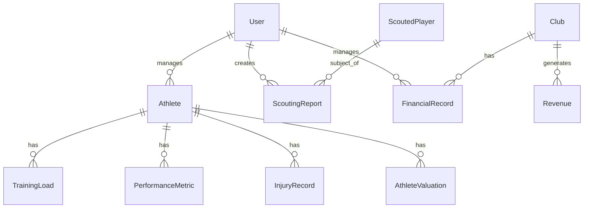

# Estrutura de Dados e Models

## Visão Geral

Este documento descreve a estrutura de dados planejada do AI Soccer. **Nota**: Os models ainda não estão implementados, esta é a especificação para implementação futura.

## Banco de Dados

- **Engine**: SQLite (desenvolvimento)
- **Arquivo**: `db.sqlite3`
- **Produção (futuro)**: PostgreSQL

## Convenções de Models

### Campos Obrigatórios

Todos os models principais devem ter:
```python
created_at = models.DateTimeField(auto_now_add=True)
updated_at = models.DateTimeField(auto_now=True)
```

### Relacionamentos com User

Sempre usar `settings.AUTH_USER_MODEL`:
```python
from django.conf import settings

created_by = models.ForeignKey(
    settings.AUTH_USER_MODEL,
    on_delete=models.CASCADE
)
```

## Diagrama ER



## Models do Domínio Accounts

### User (CustomUser)

**App**: `accounts`
**Herda de**: `AbstractUser`

```python
from django.contrib.auth.models import AbstractUser
from django.db import models

class CustomUser(AbstractUser):
    """Custom user model using email as username."""

    username = None
    email = models.EmailField('Email', unique=True)
    created_at = models.DateTimeField(auto_now_add=True)
    updated_at = models.DateTimeField(auto_now=True)

    USERNAME_FIELD = 'email'
    REQUIRED_FIELDS = ['first_name', 'last_name']

    class Meta:
        verbose_name = 'Usuário'
        verbose_name_plural = 'Usuários'

    def __str__(self):
        return self.email
```

**Campos Principais**:
- `email` (EmailField, unique) - Email do usuário
- `first_name` (CharField) - Nome
- `last_name` (CharField) - Sobrenome
- `is_active` (BooleanField) - Usuário ativo
- `is_staff` (BooleanField) - Acesso ao admin
- `created_at` (DateTimeField) - Data de criação
- `updated_at` (DateTimeField) - Última atualização

## Models do Domínio Performance

### Athlete

**App**: `performance`

```python
class Athlete(models.Model):
    """Model representing an athlete."""

    POSITION_CHOICES = [
        ('GK', 'Goleiro'),
        ('DF', 'Defensor'),
        ('MF', 'Meio-campo'),
        ('FW', 'Atacante'),
    ]

    created_by = models.ForeignKey(
        settings.AUTH_USER_MODEL,
        on_delete=models.CASCADE,
        verbose_name='Criado por'
    )

    name = models.CharField('Nome', max_length=200)
    birth_date = models.DateField('Data de nascimento')
    position = models.CharField(
        'Posição',
        max_length=2,
        choices=POSITION_CHOICES
    )
    nationality = models.CharField('Nacionalidade', max_length=100)
    height = models.FloatField('Altura (cm)')
    weight = models.FloatField('Peso (kg)')

    created_at = models.DateTimeField(auto_now_add=True)
    updated_at = models.DateTimeField(auto_now=True)

    class Meta:
        verbose_name = 'Atleta'
        verbose_name_plural = 'Atletas'
        ordering = ['-created_at']

    def __str__(self):
        return self.name

    def age(self):
        """Calculate current age."""
        from datetime import date
        today = date.today()
        return today.year - self.birth_date.year
```

**Campos**:
- `created_by` (FK User) - Usuário que cadastrou
- `name` (CharField 200) - Nome do atleta
- `birth_date` (DateField) - Data de nascimento
- `position` (CharField 2, choices) - Posição
- `nationality` (CharField 100) - Nacionalidade
- `height` (FloatField) - Altura em cm
- `weight` (FloatField) - Peso em kg
- `created_at` (DateTimeField)
- `updated_at` (DateTimeField)

### TrainingLoad

**App**: `performance`

```python
class TrainingLoad(models.Model):
    """Training load record for an athlete."""

    INTENSITY_CHOICES = [
        ('LOW', 'Baixa'),
        ('MEDIUM', 'Média'),
        ('HIGH', 'Alta'),
        ('VERY_HIGH', 'Muito Alta'),
    ]

    athlete = models.ForeignKey(
        Athlete,
        on_delete=models.CASCADE,
        related_name='training_loads',
        verbose_name='Atleta'
    )

    training_date = models.DateField('Data do treino')
    duration_minutes = models.FloatField('Duração (minutos)')
    distance_km = models.FloatField('Distância (km)')
    heart_rate_avg = models.IntegerField('FC média')
    heart_rate_max = models.IntegerField('FC máxima')
    intensity_level = models.CharField(
        'Intensidade',
        max_length=10,
        choices=INTENSITY_CHOICES
    )

    created_at = models.DateTimeField(auto_now_add=True)
    updated_at = models.DateTimeField(auto_now=True)

    class Meta:
        verbose_name = 'Carga de Treino'
        verbose_name_plural = 'Cargas de Treino'
        ordering = ['-training_date']

    def __str__(self):
        return f'{self.athlete.name} - {self.training_date}'

    def fatigue_index(self):
        """Calculate basic fatigue index."""
        # Fórmula simplificada: (distância * duração) / 1000
        return (self.distance_km * self.duration_minutes) / 1000
```

**Campos**:
- `athlete` (FK Athlete) - Atleta
- `training_date` (DateField) - Data do treino
- `duration_minutes` (FloatField) - Duração em minutos
- `distance_km` (FloatField) - Distância percorrida
- `heart_rate_avg` (IntegerField) - FC média
- `heart_rate_max` (IntegerField) - FC máxima
- `intensity_level` (CharField, choices) - Nível de intensidade

### PerformanceMetric

**App**: `performance`

**Campos**:
- `athlete` (FK Athlete)
- `measurement_date` (DateField)
- `speed_max` (FloatField) - Velocidade máxima (km/h)
- `acceleration` (FloatField) - Aceleração
- `sprint_count` (IntegerField) - Número de sprints
- `fatigue_index` (FloatField) - Índice de fadiga
- `created_at`, `updated_at`

### InjuryRecord

**App**: `performance`

**Campos**:
- `athlete` (FK Athlete)
- `injury_date` (DateField) - Data da lesão
- `injury_type` (CharField) - Tipo de lesão
- `body_part` (CharField) - Parte do corpo
- `severity_level` (IntegerField 1-5) - Gravidade
- `expected_return` (DateField) - Previsão de retorno
- `notes` (TextField) - Observações
- `created_at`, `updated_at`

## Models do Domínio Scouting

### ScoutedPlayer

**App**: `scouting`

**Campos**:
- `created_by` (FK User)
- `name` (CharField 200)
- `birth_date` (DateField)
- `position` (CharField, choices)
- `current_club` (CharField 200)
- `nationality` (CharField 100)
- `market_value` (DecimalField) - Valor de mercado
- `notes` (TextField) - Observações gerais
- `created_at`, `updated_at`

### ScoutingReport

**App**: `scouting`

**Campos**:
- `player` (FK ScoutedPlayer)
- `created_by` (FK User) - Scout responsável
- `technical_score` (FloatField 0-10) - Nota técnica
- `physical_score` (FloatField 0-10) - Nota física
- `tactical_score` (FloatField 0-10) - Nota tática
- `mental_score` (FloatField 0-10) - Nota mental
- `potential_score` (FloatField 0-10) - Potencial
- `observations` (TextField) - Observações detalhadas
- `created_at`, `updated_at`

**Métodos**:
```python
def overall_score(self):
    """Calculate overall score."""
    return (
        self.technical_score +
        self.physical_score +
        self.tactical_score +
        self.mental_score +
        self.potential_score
    ) / 5
```

## Models do Domínio Business

### Club

**App**: `business`

**Campos**:
- `name` (CharField 200) - Nome do clube
- `country` (CharField 100) - País
- `division` (CharField 100) - Divisão/Liga
- `created_at`, `updated_at`

### FinancialRecord

**App**: `business`

**Campos**:
- `club` (FK Club)
- `record_date` (DateField) - Data do registro
- `category` (CharField, choices) - Categoria da transação
- `amount` (DecimalField) - Valor
- `transaction_type` (CharField) - 'REVENUE' ou 'EXPENSE'
- `description` (TextField) - Descrição
- `created_at`, `updated_at`

**Choices de Category**:
```python
CATEGORY_CHOICES = [
    ('SALARY', 'Salários'),
    ('TRANSFER', 'Transferências'),
    ('SPONSOR', 'Patrocínio'),
    ('TICKET', 'Bilheteria'),
    ('BROADCAST', 'Direitos de TV'),
    ('OTHER', 'Outros'),
]
```

### Revenue

**App**: `business`

**Campos**:
- `club` (FK Club)
- `year` (IntegerField) - Ano
- `month` (IntegerField 1-12) - Mês
- `ticketing` (DecimalField) - Receita de bilheteria
- `sponsorship` (DecimalField) - Patrocínio
- `broadcasting` (DecimalField) - Direitos de transmissão
- `merchandising` (DecimalField) - Produtos
- `created_at`, `updated_at`

**Métodos**:
```python
def total_revenue(self):
    """Calculate total revenue."""
    return (
        self.ticketing +
        self.sponsorship +
        self.broadcasting +
        self.merchandising
    )
```

### AthleteValuation

**App**: `business`

**Campos**:
- `athlete` (FK performance.Athlete)
- `valuation_date` (DateField) - Data da avaliação
- `estimated_value` (DecimalField) - Valor estimado (IA)
- `market_comparison` (DecimalField) - Comparação com mercado
- `notes` (TextField) - Observações
- `created_at`, `updated_at`

## Índices e Performance

### Índices Recomendados

```python
class Meta:
    indexes = [
        models.Index(fields=['birth_date']),      # Para filtros de idade
        models.Index(fields=['position']),        # Para filtros de posição
        models.Index(fields=['-training_date']),  # Para ordenação de treinos
        models.Index(fields=['created_at']),      # Para ordenação cronológica
    ]
```

## Validações Customizadas

### Exemplo: Validar data de nascimento

```python
from django.core.exceptions import ValidationError
from datetime import date

def clean(self):
    """Validate model fields."""
    if self.birth_date > date.today():
        raise ValidationError({
            'birth_date': 'Data de nascimento não pode ser no futuro.'
        })
```

## Migrations

### Criar Migrações

```bash
# Após criar/editar models
python manage.py makemigrations

# Aplicar migrações
python manage.py migrate

# Ver SQL de uma migração
python manage.py sqlmigrate app_name 0001
```

### Convenções de Naming

- Migrations automáticas: `0001_initial.py`, `0002_auto_...`
- Migrations manuais: `0003_add_athlete_photo_field.py`

---

**Última Atualização**: 2025-10-28
